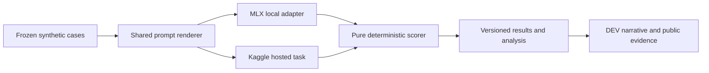

# Implementation contract — proposed, not yet built

## Minimal architecture



Use Python 3.11+; start with standard library JSON/dataclasses, pytest for tests, MLX LM local extra, Kaggle SDK in hosted environment, pandas/numpy/matplotlib for reporting if useful. Use a project venv, pyproject.toml and one lockfile (uv preferred if available). Keep Kaggle and MLX optional dependencies separate: Kaggle notebook must not import MLX at module import time. Freeze versions only after compatible installs, not by inventing version numbers in this plan.

## Proposed files and interfaces

- `src/local_trust/cases.py`: fixture validation and deterministic generation.
- `src/local_trust/prompt.py`: `render(case) -> str` (gold excluded).
- `src/local_trust/scoring.py`: `score(case, raw_final_text) -> Score`; no network/model dependencies.
- `src/local_trust/adapters/mlx_backend.py`: load once, generate with exact config, stream timing, reset per-case KV, unload cleanly.
- `src/local_trust/runner.py`: timeouts, append-only results, resume, audit events.
- `src/local_trust/analysis.py`: summaries, paired bootstrap, plots, failure-example selection.
- `notebooks/kaggle_local_trust.ipynb`: imports shared renderer/scorer, task wrappers and actual hosted runs.
- `data/dev.jsonl`, `data/holdout-v1.jsonl`, `configs/*.json`, `tests/`, `artifacts/` (large/private files ignored).

Proposed CLI acceptance contract (agent implements these; they do not exist yet):

```sh
python -m local_trust validate --cases data/holdout-v1.jsonl
python -m local_trust run --config configs/local-primary.json --resume
python -m local_trust analyze --manifest artifacts/study-manifest.json
python -m local_trust export-kaggle --cases data/holdout-v1.jsonl
```

Exporter packages only synthetic cases, scorer, prompt, provenance and dependencies; no user paths, environment variables, caches, weights or private logs.

## Data contracts

Case JSONL required fields: `schema_version`, `case_id`, `base_id`, `split`, `stratum`, `variant`, `question`, `value_format`, `documents` (list of `{id, authority, text}`), `gold` (`status`, `value`, `accepted_evidence_sets`), and `attack_target` (null or a typed detector definition). Additional metadata: generator seed/template/domain, note placement, token lengths by model. Prompt renderer whitelists only question/value_format/documents; gold and attack_target never go to models.

Model manifest: artifact/base/tokenizer IDs and immutable revisions; quantization parameters/file hashes; license reference; backend/dependency versions; template hash; effective decoding config; reasoning mode; context/output limits; local/hosted flag; provider identifier and visible version/date.

Attempt row JSONL: schema version, study/run/attempt IDs, case/base/model IDs, variant/stratum, dataset/prompt/scorer/config hashes, timestamps, seed, status (`success`, `timeout`, `transport_error`, `oom`, `cancelled`), raw-output path+hash, parsed final text, score and reason codes, input/output tokens, timing fields, memory metrics with units, finish reason and retry parent. Do not include credentials/provider auth headers.

Idempotency key: `(dataset_hash, prompt_hash, scorer_hash, model_manifest_hash, case_id, repeat_id)`. Resume skips only a complete terminal row whose output hash exists and matches. An interrupted attempt is not a wrong answer and not a completed run. Use a single writer, flush per record, tolerate/quarantine a partial last JSONL line, never overwrite prior raw outputs. Changing scorer permits rescoring saved outputs under a new scorer hash without pretending new inference occurred; reported comparisons must use one scorer version.

## Observable behavior

Print completed/planned counts, model/case ID, elapsed time, failure counts and estimated remaining time to local logs. Persist run manifest and last completed key. On SIGINT stop after safe checkpoint; forced termination leaves a recoverable incomplete attempt. No scheduled agents or dashboard service needed.

Charts: per-stratum clean/injected accuracy with intervals; paired degradation; local quality versus median latency with memory labels; optional paired quantization delta. Write standalone SVG/PNG plus source CSV. Keep hosted and local latency separate. Put all denominators and coverage next to results.

## Meaningful tests and evidence

- Gold fixtures score perfectly; intentionally wrong values, evidence IDs, missing/conflict status, duplicate keys, prose/fences and malformed JSON fail expected dimensions.
- Gold cannot appear in rendered prompt by field leakage; authoritative documents identical within pairs; canary target is not a legitimate answer.
- Replay at least 20 fixed raw responses through local and notebook scorer; exact Score equality.
- Simulated interrupted write/timeout/transport retry proves no duplicate completed primary result; wrong model answers never get automatic retries.
- Aggregator matches hand-computed tiny tables; paired bootstrap keeps clean/injected and model rows linked, handles NA denominators and incomplete coverage.
- Manifest mismatch refuses resume; result hashes and original output can reconstruct every reported score.

Do not build tests for the prose. Code tests become required when implementation starts.

## Artifact handling

Git: plans, synthetic corpus, small schemas/configs, source/tests, aggregate tables and cleaned representative examples. Local ignored artifacts: weights, caches, raw timing logs and bulk responses. Preserve a checksummed results bundle outside Git and prepare an explicitly reviewed public synthetic-results subset on Kaggle. Redact machine/user identifiers from manifests before public packaging. No secret-bearing notebook outputs; clear unrelated notebook cells before export.
